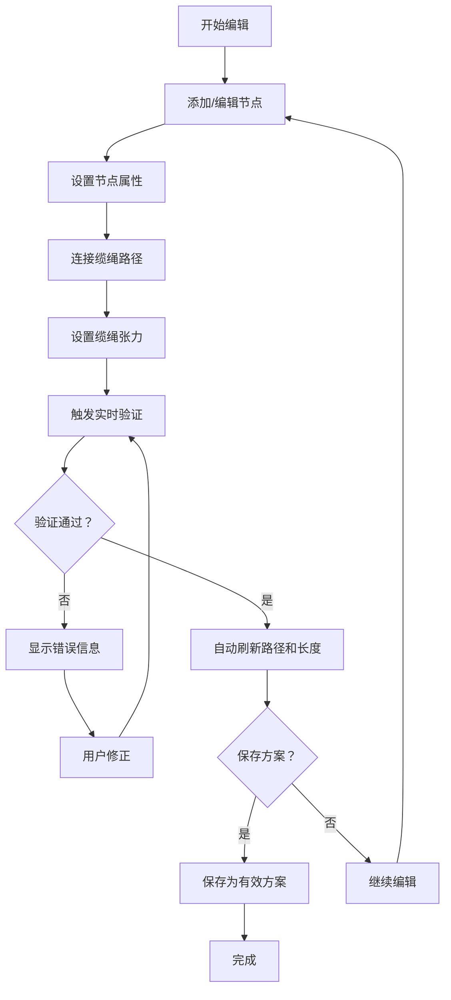

## 1. 产品概述

古船缆绳穿绕编辑器是一款面向古船模型爱好者和海事博物馆团队的专业工具，用于可视化记录和验证桅杆、滑轮、系索点与帆缆的真实穿绕路径。用户可在结构图上交互编辑缆绳网络，系统自动校验穿绕规则并计算路径长度，确保缆绳方案的准确性和可保存性。

### 1.1 核心价值
- 可视化缆绳穿绕路径，降低理解和沟通成本
- 自动检测错误绕法，避免无效方案
- 实时计算缆绳长度和张力，辅助方案优化
- 支持方案保存和复用，便于团队协作

### 1.2 目标用户
- 古船模型制作爱好者
- 海事博物馆策展和研究团队
- 船舶历史研究者
- 航海教育工作者

---

## 2. 核心功能

### 2.1 用户角色
| 角色 | 注册方式 | 核心权限 |
|------|----------|----------|
| 普通用户 | 无需注册，本地使用 | 创建、编辑、保存缆绳方案，执行验证检查 |

### 2.2 功能模块
1. **主编辑器页面**：图形画布、节点工具栏、属性面板、验证结果区
2. **节点管理**：添加/编辑/删除桅杆、滑轮、系索点
3. **缆绳编辑**：连接节点形成穿绕路径，设置缆绳属性
4. **属性配置**：滑轮方向、缆绳张力、节点编号
5. **验证系统**：错误检测、规则校验、闭合性检查
6. **统计面板**：缆绳长度统计、张力分布展示

### 2.3 页面详情
| 页面名称 | 模块名称 | 功能描述 |
|----------|----------|----------|
| 主编辑器 | 图形画布 | 基于 Cytoscape.js 的交互式图编辑区域，支持拖拽节点、缩放、平移 |
| 主编辑器 | 节点工具栏 | 快速添加桅杆、滑轮、系索点三种节点类型 |
| 主编辑器 | 属性面板 | 显示选中节点/缆绳的详细属性，支持编辑修改 |
| 主编辑器 | 验证结果区 | 实时显示错误和警告信息，点击可定位问题元素 |
| 主编辑器 | 统计面板 | 展示所有缆绳的总长度、各缆绳长度、张力分布等统计数据 |
| 主编辑器 | 方案操作 | 新建、保存、加载、清空缆绳方案 |

---

## 3. 核心流程

### 3.1 缆绳方案创建流程
用户打开编辑器 → 添加桅杆/滑轮/系索点节点 → 设置节点属性（编号、位置、滑轮方向等）→ 连接节点形成缆绳路径 → 设置缆绳属性（张力、类型）→ 系统实时验证 → 检查无误后保存方案

### 3.2 验证检测流程
用户操作节点或缆绳 → 触发验证逻辑 → 检查节点编号唯一性 → 检查缆绳长度/张力有效性 → 检查停用滑轮是否被使用 → 检查缆绳首尾闭合性 → 检查穿绕路径合法性 → 显示验证结果 → 全部通过方可保存

### 3.3 流程图

---

## 4. 用户界面设计

### 4.1 设计风格

**设计主题**：海事/工业风格，融合航海元素与现代UI

- **主色调**：深海蓝 `#0A2463`，象征海洋和专业感
- **辅助色**：船帆白 `#F8F9FA`、绳索棕 `#8B4513`、警示红 `#E63946`、成功绿 `#2A9D8F`
- **强调色**：黄铜金 `#D4A574`，用于滑轮和重要操作按钮
- **字体**：
  - 标题：`Playfair Display`，衬线字体，体现历史感
  - 正文：`Inter`，无衬线字体，保证可读性
- **按钮风格**：微立体设计，圆角 `6px`，悬停有轻微上浮效果
- **布局风格**：三栏式布局（左工具栏 + 中央画布 + 右属性面板），卡片式容器
- **图标**：使用航海主题图标，锚、滑轮、绳索、桅杆等元素

### 4.2 页面设计概述

| 页面名称 | 模块名称 | UI 元素 |
|----------|----------|---------|
| 主编辑器 | 顶部导航栏 | 品牌标识、方案名称、保存/加载按钮、用户菜单 |
| 主编辑器 | 左侧工具栏 | 节点类型选择器（桅杆/滑轮/系索点）、编辑工具（选择/连接/删除）、缩放控制 |
| 主编辑器 | 中央画布 | Cytoscape.js 图形区域、网格背景、节点拖拽、连线预览 |
| 主编辑器 | 右侧属性面板 | 分折叠区域：节点属性、缆绳属性、验证结果、统计信息 |
| 主编辑器 | 底部状态栏 | 选中元素信息、坐标显示、验证状态指示器、快捷操作提示 |

### 4.3 响应式设计
- **桌面端**：三栏式完整布局，最小宽度 1280px
- **平板端**：左右面板可折叠收起，画布区域自适应
- **移动端**：工具栏转为底部浮动条，属性面板改为底部抽屉

### 4.4 动效设计
- 节点选中：脉冲高亮动画
- 缆绳连接：贝塞尔曲线平滑过渡
- 错误提示：轻微抖动动画 + 红色边框闪烁
- 面板展开/收起：滑入滑出过渡动画（200ms ease-out）
- 按钮悬停：背景色渐变 + 轻微放大（scale: 1.02）
