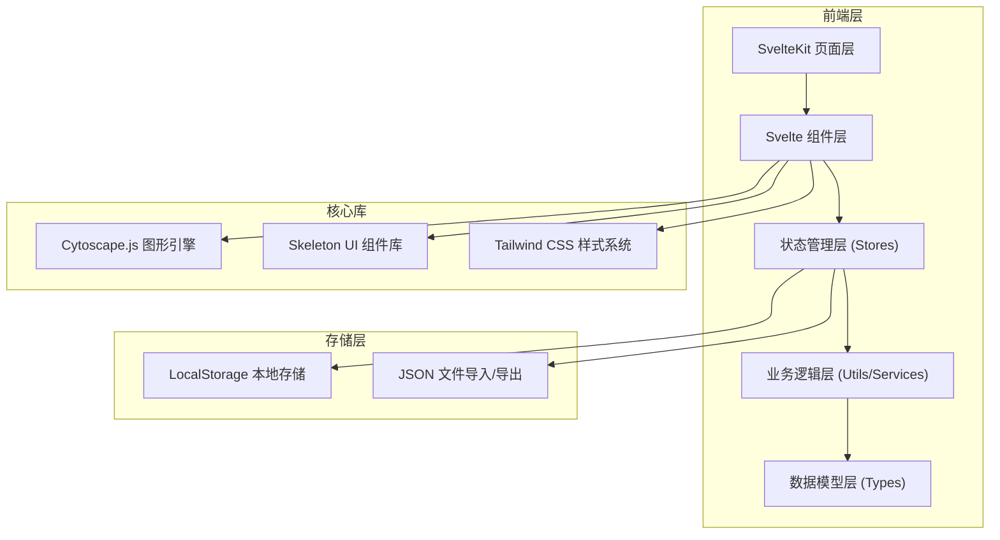
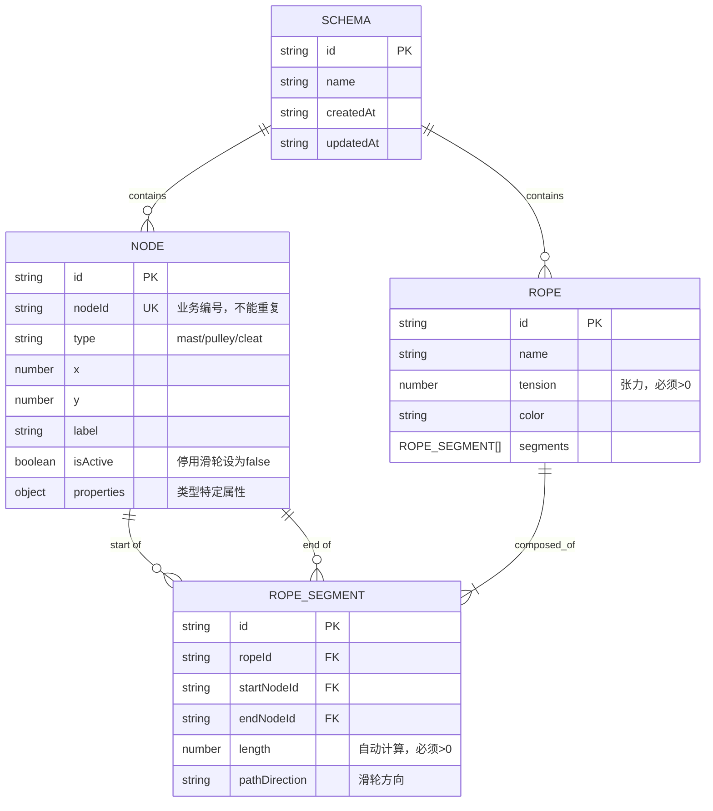
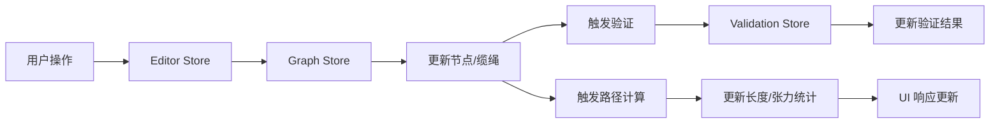

## 1. 架构设计



## 2. 技术栈描述

- **前端框架**：SvelteKit 2.x + TypeScript 5.x
- **图形引擎**：Cytoscape.js 3.x + cytoscape-edgehandles
- **UI 组件库**：@skeletonlabs/skeleton 4.x
- **样式系统**：Tailwind CSS 4.x
- **构建工具**：Vite 5.x
- **状态管理**：Svelte Stores (原生)
- **数据存储**：LocalStorage + JSON 文件
- **代码规范**：ESLint + Prettier + TypeScript 严格模式

### 2.1 核心依赖版本
- `svelte`: ^5.x
- `@sveltejs/kit`: ^2.x
- `cytoscape`: ^3.x
- `cytoscape-edgehandles`: ^4.x
- `@skeletonlabs/skeleton`: ^4.x
- `tailwindcss`: ^4.x
- `typescript`: ^5.x

## 3. 目录结构

```
src/
├── lib/
│   ├── components/          # UI 组件
│   │   ├── editor/          # 编辑器相关组件
│   │   │   ├── GraphCanvas.svelte      # Cytoscape 画布
│   │   │   ├── Toolbar.svelte          # 左侧工具栏
│   │   │   ├── PropertyPanel.svelte    # 右侧属性面板
│   │   │   ├── ValidationPanel.svelte  # 验证结果面板
│   │   │   └── StatsPanel.svelte       # 统计面板
│   │   ├── nodes/           # 节点类型组件
│   │   │   ├── MastNode.svelte         # 桅杆节点
│   │   │   ├── PulleyNode.svelte       # 滑轮节点
│   │   │   └── CleatNode.svelte        # 系索点节点
│   │   └── common/          # 通用组件
│   │       ├── Modal.svelte
│   │       ├── Button.svelte
│   │       └── Input.svelte
│   ├── stores/              # 状态管理
│   │   ├── graphStore.ts    # 图数据状态
│   │   ├── editorStore.ts   # 编辑器状态
│   │   └── validationStore.ts  # 验证状态
│   ├── types/               # 类型定义
│   │   ├── graph.ts         # 图数据类型
│   │   ├── nodes.ts         # 节点类型
│   │   └── validation.ts    # 验证类型
│   ├── utils/               # 工具函数
│   │   ├── graphUtils.ts    # 图操作工具
│   │   ├── pathCalculator.ts # 路径计算
│   │   ├── validator.ts     # 验证逻辑
│   │   └── exportImport.ts  # 导入导出
│   └── constants/           # 常量配置
│       ├── nodeTypes.ts     # 节点类型配置
│       └── validationRules.ts # 验证规则
├── routes/
│   ├── +layout.svelte       # 根布局
│   └── +page.svelte         # 主编辑器页面
├── app.d.ts
└── app.html
```

## 4. 核心数据模型

### 4.1 数据模型定义



### 4.2 TypeScript 类型定义

```typescript
// 节点类型
export type NodeType = 'mast' | 'pulley' | 'cleat';

export interface BaseNode {
  id: string;
  nodeId: string;
  type: NodeType;
  x: number;
  y: number;
  label: string;
  isActive: boolean;
}

export interface MastNode extends BaseNode {
  type: 'mast';
  properties: {
    height: number;
    section: string;
  };
}

export interface PulleyNode extends BaseNode {
  type: 'pulley';
  properties: {
    direction: 'clockwise' | 'counterclockwise' | 'bidirectional';
    sheaveCount: number;
    isActive: boolean;
  };
}

export interface CleatNode extends BaseNode {
  type: 'cleat';
  properties: {
    cleatType: 'horn' | 'cam' | 'jam';
  };
}

export type GraphNode = MastNode | PulleyNode | CleatNode;

// 缆绳类型
export interface RopeSegment {
  id: string;
  ropeId: string;
  startNodeId: string;
  endNodeId: string;
  length: number;
  pulleyDirection?: 'in' | 'out';
}

export interface Rope {
  id: string;
  name: string;
  tension: number;
  color: string;
  segments: RopeSegment[];
  isClosed: boolean;
}

// 方案类型
export interface RopeSchema {
  id: string;
  name: string;
  createdAt: string;
  updatedAt: string;
  nodes: GraphNode[];
  ropes: Rope[];
}

// 验证类型
export type ValidationSeverity = 'error' | 'warning' | 'info';

export interface ValidationIssue {
  id: string;
  severity: ValidationSeverity;
  message: string;
  elementId?: string;
  elementType?: 'node' | 'rope' | 'segment';
  ruleCode: string;
}

export interface ValidationResult {
  isValid: boolean;
  issues: ValidationIssue[];
  summary: {
    errors: number;
    warnings: number;
    infos: number;
  };
}
```

## 5. 核心业务逻辑

### 5.1 验证规则 (Validator)

| 规则代码 | 描述 | 严重程度 |
|----------|------|----------|
| NODE_ID_DUPLICATE | 节点编号重复 | error |
| ROPE_TENSION_INVALID | 缆绳张力 <= 0 | error |
| SEGMENT_LENGTH_INVALID | 缆绳分段长度 <= 0 | error |
| PULLEY_DISABLED_IN_PATH | 停用滑轮参与路径 | error |
| ROPE_NOT_CLOSED | 缆绳首尾未闭合 | error |
| INVALID_PULLEY_DIRECTION | 滑轮穿绕方向错误 | error |
| PATH_NOT_SAVEABLE | 存在错误无法保存 | error |
| EMPTY_SCHEMA | 方案为空 | warning |
| SINGLE_NODE_ROPE | 缆绳只连接一个节点 | warning |

### 5.2 路径计算逻辑

1. **坐标距离计算**：使用欧几里得距离公式计算两点间线段长度
2. **滑轮绕行计算**：根据滑轮方向计算绕行弧长
3. **总长度累加**：遍历缆绳所有分段，累加得到总长度
4. **自动刷新触发**：节点位置变化、节点删除、缆绳分段变化时触发

### 5.3 状态管理数据流



## 6. API 定义（本地操作）

| 操作类型 | 函数签名 | 说明 |
|----------|----------|------|
| 节点操作 | `addNode(node: GraphNode): void` | 添加节点 |
| 节点操作 | `updateNode(id: string, updates: Partial<GraphNode>): void` | 更新节点 |
| 节点操作 | `deleteNode(id: string): void` | 删除节点 |
| 缆绳操作 | `addRope(rope: Rope): void` | 添加缆绳 |
| 缆绳操作 | `updateRope(id: string, updates: Partial<Rope>): void` | 更新缆绳 |
| 缆绳操作 | `deleteRope(id: string): void` | 删除缆绳 |
| 分段操作 | `addSegment(ropeId: string, segment: RopeSegment): void` | 添加分段 |
| 验证操作 | `validateSchema(schema: RopeSchema): ValidationResult` | 验证方案 |
| 计算操作 | `calculateRopeLength(rope: Rope, nodes: GraphNode[]): number` | 计算缆绳长度 |
| 导入导出 | `exportSchema(schema: RopeSchema): string` | 导出 JSON |
| 导入导出 | `importSchema(json: string): RopeSchema` | 导入 JSON |

## 7. 性能与质量保证

### 7.1 性能优化
- 节点数量 < 100 时实时计算无延迟
- 缆绳分段变更时使用局部刷新而非全量重绘
- Cytoscape.js 启用视口剔除和层级渲染
- 使用 `requestAnimationFrame` 协调动画帧

### 7.2 测试策略
- 单元测试：验证规则、路径计算工具函数
- 组件测试：核心 Svelte 组件渲染测试
- E2E 测试：完整编辑流程（添加节点→连接缆绳→验证→保存）
- 类型测试：TypeScript `strict` 模式 + `svelte-check`

### 7.3 代码质量
- ESLint 规则：TypeScript 推荐规则 + Svelte 特定规则
- Prettier 统一代码格式化
- 组件单文件不超过 300 行
- 工具函数单一职责，纯函数优先
